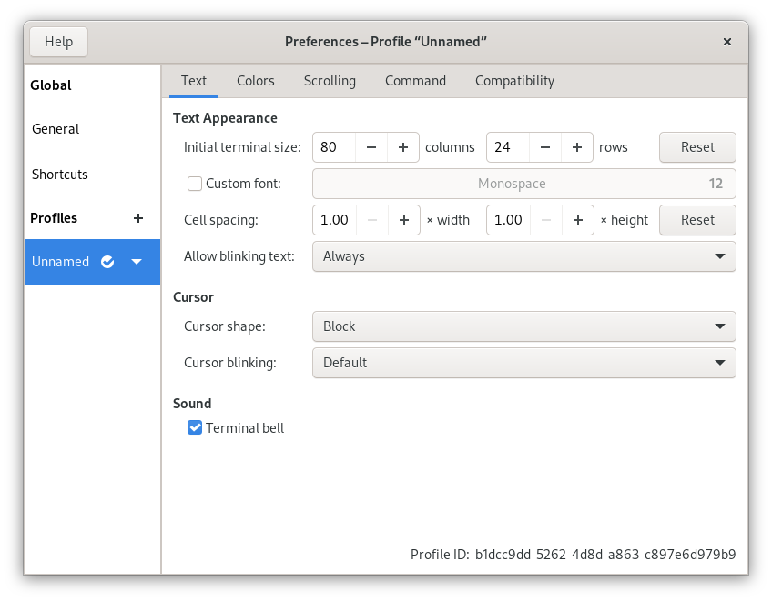

# GNOME Terminal

## Usage
GNOME Terminal instances can be discovered and controlled via DBus, but it's a cumbersome process to perform in a one-liner. `thcon` simplifies that - just list the IDs of the GNOME Terminal profiles you prefer in light mode and in dark mode in your `thcon.toml`, e.g.:

```toml
[gnome-terminal]
dark = "f25b5812-61d9-4469-8009-142721cfd35c"
light = "7f6e0978-dee1-48e8-8212-50dc1810a720"
```

Profile IDs are easily copied from the bottom corner of the GNOME Terminal Preferences window:



## Config Schema
Section: `gnome-terminal`

| Key | Type | Description | Default |
| --- | ---- | ----------- | -------- |
| `disabled` | boolean | `true` to disable theming of this app, otherwise `false` | `false` |
| `dark` | string | The ID of the profile (case-sensitive) to use in dark mode | (none) |
| `light` | string | The ID of the profile (case-sensitive) to use in light mode | (none) |

